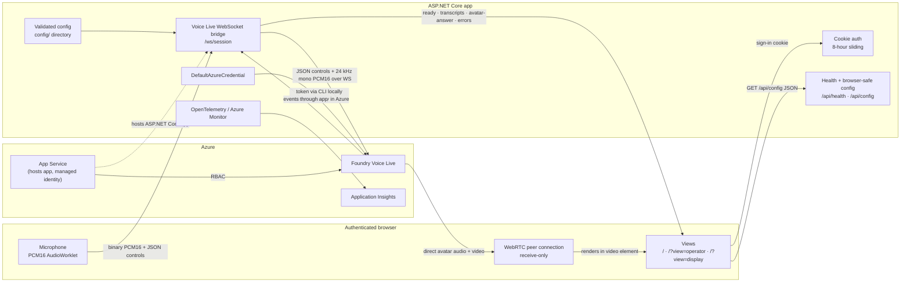
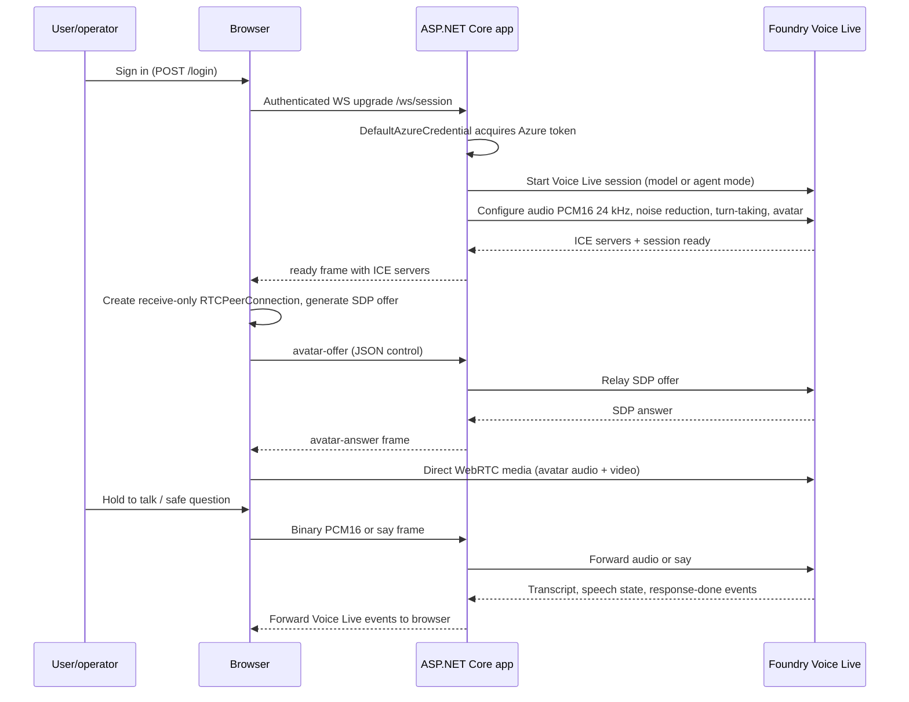

# Foundry Voice Live Avatar

A stage-ready conversational avatar built on [Microsoft Foundry Voice Live](https://learn.microsoft.com/azure/ai-foundry/ai-services/). A thin TypeScript browser client pairs with an ASP.NET Core 10 server; the server holds all Azure credentials, owns the Voice Live session lifetime, and bridges audio and control frames. Avatar media flows directly from Azure to the browser over WebRTC.

**Three views**, all served from the same app:

| URL | Purpose |
|-----|---------|
| `/` | Fullscreen avatar landing — audience/presenter display |
| `/?view=operator` | Operator console — session controls, transcript, tool events, diagnostics |
| `/?view=display` | Dedicated display surface for secondary screens |

By default the app runs in **model mode** using `gpt-realtime`. Optional **agent mode** uses a named Voice Live agent created in the Azure AI Foundry portal. Reliability features include manual turn gating (Hold to talk, gated, or open-mic), an operator-initiated **Reconnect** control on every view, health and error reporting at `/api/health`, and safe-question injection.

## Why this exists

This avatar converses **on stage with a C-level leader**, explaining company direction to a live audience, in a room that may be noisy. That single scenario, not a general chatbot use case, drives every design decision here.

**Reliability and rehearsability beat features.** Anything that can fail mid-show needs a defined behaviour and an operator control. The consequences run through the whole codebase:

| Decision | Because |
|---|---|
| Hold-to-talk turn gating is the default | An open microphone in a noisy room triggers on audience noise. The operator decides when the avatar listens. |
| Safe questions are one click away | If live Q&A stalls, the operator injects a known-good prompt rather than improvising. |
| Deep noise suppression and server-side VAD | Stage audio is hostile. |
| Failures are explicit, never masked | A silent retry on stage is indistinguishable from a hang. Every failure surfaces in the operator view with an action. |
| A dedicated operator view, separate from the display view | The audience must never see diagnostics. |
| A written rehearsal checklist | The show is rehearsed, so the software must be too. |

## Non-goals

Stating these plainly, because the architecture only makes sense against them:

- **Not multi-tenant and not multi-user.** Authentication is one shared username and password. Everyone who signs in is the same principal, and there is no per-operator identity, audit trail, or authorization model.
- **Not internet-facing by intent — but `azd up` publishes a public endpoint.** The Bicep template provisions a public App Service with no IP restrictions or VNet integration; the only access control out of the box is the shared username/password. Restricting network access is the operator's responsibility. See [Non-goals](#non-goals) and [Production readiness](#production-readiness) before exposing this to an untrusted network.
- **Not a persistent assistant.** There is no conversation storage, no cross-session memory, and no user profile.
- **Not horizontally scalable as configured.** The concurrency cap is a per-instance in-memory gate; scaling out multiplies it rather than sharing it.
- **One session per browser tab.** Opening the operator and display views simultaneously consumes two of the two available session slots.

## How it works



**Two paths after session start:**

1. **Control + audio path** — JSON control frames and binary PCM16 audio travel `browser → /ws/session → Voice Live` and back. The app acts as a trusted relay: it adds the Azure token, enforces the concurrent-session gate, applies config, and sanitizes errors before forwarding events to the browser.
2. **Media path** — avatar audio and video stream directly from Azure to the browser over a receive-only WebRTC peer connection. The app relays only the SDP offer/answer and ICE server list; media bytes never touch the server.

## Quickstart

**Prerequisites**

- .NET 10 SDK
- Node.js 24
- Azure CLI (`az`)
- Access to a Voice Live / avatar-capable Azure AI Foundry resource
- `Cognitive Services User` and `Foundry User` roles on the resource

Verify the toolchain and your Azure access before the first run — a missing role assignment is the most common first-run failure:

```bash
dotnet --version   # 10.0 or later
node --version     # 24 or later
python3 --version  # required by the Playwright suite's static file server
az account show --query '{sub:name, user:user.name}' -o table
az role assignment list --assignee "$(az ad signed-in-user show --query id -o tsv)" \
  --all --include-groups --include-inherited --query "[].roleDefinitionName" -o tsv
```

The last command should list **Cognitive Services User** and **Foundry User**. If it prints nothing, check whether the roles are granted via an Entra group or at a management-group scope (which the default subscription-only search misses), and confirm you are on the subscription that hosts the Foundry account. If the roles are genuinely absent, session creation will fail at connect time with a `403` even though `/api/health` reports Healthy.

**Steps**

```bash
az login
# optional: az account set --subscription <subscription-id>
export VoiceLive__Endpoint="https://<your-resource>.services.ai.azure.com"  # Foundry account endpoint
export VoiceLive__Mode=model
```

Set your own local credentials once — they are stored outside the repository and are never committed:

```bash
dotnet user-secrets --project web/src/VoiceLive.Web set "Auth:Username" "<your-username>"
dotnet user-secrets --project web/src/VoiceLive.Web set "Auth:Password" "<your-password>"
```

Then start the app (MSBuild automatically runs `npm ci && npm run build` via the `BuildFrontend` target before the app starts):

```bash
dotnet run --project web/src/VoiceLive.Web
```

Open **http://localhost:5280/** and sign in with the credentials you set above.

- Grant microphone access when prompted.
- Press and hold **Hold to talk** to speak, or switch turn-taking mode in the operator view.
- Share `/?view=operator` with operators and `/?view=display` with display screens.

**Verify the app is healthy:**

```bash
curl -s http://localhost:5280/api/health; echo
```

`DefaultAzureCredential` picks up your `az login` token locally and the system-assigned managed identity in Azure. If the token expires, restart the session; the credential refreshes automatically between sessions. If avatar capacity is unavailable the server sends an `avatar-error` frame — **avatar audio is lost along with the video** (both ride the same WebRTC peer connection), so there is no voice-only fallback at this time. The operator must invoke a fallback plan (see [runbook §9](docs/runbook.md#9-failure-handling)).

## Development

Full setup, prerequisites and conventions are in [CONTRIBUTING.md](CONTRIBUTING.md). The commands you need most:

```bash
# Backend tests — skip the frontend build for speed, as CI does
dotnet test web/VoiceLive.Web.sln -p:SkipFrontendBuild=true

# Frontend type check
npm --prefix web/frontend run typecheck

# Playwright end-to-end tests (requires Python 3 on PATH for the static server)
npm --prefix web/frontend test
```

## Production readiness

**Read this before exposing the app to any network you do not control.**

As shipped, this application is built for a **rehearsed, operator-attended, single-event deployment on a trusted network**. Two independent security reviews of commit `d5110dc` ([`review-merged.md`](review-merged.md)) concluded it is not ready for untrusted or internet-facing users. Nothing about the deployment path below enforces that boundary — as noted in [Non-goals](#non-goals), `azd up` produces a public HTTPS endpoint protected by a single shared password.

Close these before an exposed deployment. IDs link to the finding detail in [`review-merged.md`](review-merged.md).

| # | Finding | Required action |
|---|---|---|
| 1 | [**C-02**](review-merged.md#c-02--working-credentials-committed-to-the-repository--critical) | The committed credentials (`Auth` block) have been removed and moved to `dotnet user-secrets`; `appsettings.Development.json` now carries non-sensitive logging overrides only. Operator obligation: if the Azure AI Services account named in the former endpoint was ever real and its name is sensitive, re-provision it. |
| 2 | [**C-01**](review-merged.md#c-01--login-rate-limiter-bypassable-via-spoofed-x-forwarded-for--critical) | Configure `ForwardedHeadersOptions` with known proxies and partition the rate limiter on the validated client IP; today the per-IP limiter is bypassable by a forged header. |
| 3 | [**H-01**](review-merged.md#h-01--say-control-frame-is-an-unrestricted-prompt-injection-and-cost-channel--high) | Constrain the `say` control frame to a server-side allow-list, with a length cap and per-connection rate limit. Any authenticated client can currently make the avatar speak arbitrary text on stage. |
| 4 | [**M-01**](review-merged.md#m-01--no-idle-or-absolute-session-timeout-capacity-gate-trivially-exhausted--high) | Add absolute and idle session timeouts. There is no timeout today, and the service bills per session-minute. |
| 5 | [**M-02**](review-merged.md#m-02--auth__password-stored-as-a-plaintext-app-service-setting--high) | Move `Auth__Password` out of plaintext App Service settings into a Key Vault reference. |
| 6 | [**H-02**](review-merged.md#h-02--no-csrfantiforgery-protection-on-post-login-and-post-logout--high) | Add antiforgery protection to `POST /login`. |
| 7 | [**H-05**](review-merged.md#h-05--avatar-autoplay-failure-destroys-the-session-in-unattended-views--mediumhigh) | Make blocked autoplay recoverable instead of terminating the session. |

**Also required, and not covered by the code findings above:** decide the identity model (a single shared credential is the whole authentication story today), plan avatar-rendering quota ahead of the event, set up alerting on `/api/health`, and agree a rollback procedure. See [`docs/production-deployment.md`](docs/production-deployment.md).

## Deploy to Azure

> **Before running `azd up`**, close the findings in [Production readiness](#production-readiness) — the command produces a public HTTPS endpoint.

```bash
az login && azd auth login
azd env new <name>
azd env set AZURE_LOCATION swedencentral
azd env set AUTH_USERNAME <username>
azd env set AUTH_PASSWORD <password>
azd up
```

`azd up` provisions a Foundry account and project, a Linux App Service plan (B1), Application Insights, Log Analytics, and RBAC assignments, then builds the frontend and deploys the app. Out of the box it runs in **model mode** (`gpt-realtime`).

**Optional agent mode:** create a Voice Live agent in the Azure AI Foundry portal, set its name in `config/agent.json`, then:

```bash
azd env set VOICELIVE_MODE agent
azd up
```

The `postprovision` hook runs `scripts/setup-agent.sh` (or `.ps1`) which lists existing agents and prints the steps above. See [docs/runbook.md](docs/runbook.md) for environment variables, self-contained deployment, region availability, and day-two operations.

## Session startup



The turn lifecycle, the status channels and what each view can do are documented in [`docs/session-flow.md`](docs/session-flow.md).

## Architecture

### Application host and endpoints

`Program.cs` is the composition root. It wires:

- **Cookie authentication** — 8-hour sliding session, HttpOnly, SameSite=Lax, Secure outside development.
- **Login rate limiting** — fixed-window 5 attempts / minute per IP; returns 429.
- **HSTS and HTTPS redirect** — enabled outside development.
- **Security headers** — `X-Content-Type-Options: nosniff`, `X-Frame-Options: DENY`, `Referrer-Policy: no-referrer`, and a `Content-Security-Policy` on every response:

  ```
  default-src 'self'; img-src 'self' data: blob:; media-src 'self' blob:;
  connect-src 'self' wss: https:; script-src 'self'; style-src 'self' 'unsafe-inline';
  worker-src 'self' blob:
  ```

  Note the current policy is **not** maximally strict: `connect-src` permits any HTTPS/WSS host, `style-src` permits inline styles because `index.html` inlines its CSS, and `frame-ancestors`, `base-uri`, `form-action` and `object-src` are not set. Tracked as finding M-11 in [`review-merged.md`](review-merged.md).
- **WebSocket middleware** — origin validation against `AllowedOrigins` (same-origin allowed by default), 30-second keepalive, concurrent-session gate.
- **Config health** — `ConfigHealthCheck` reports unhealthy if config failed to load at startup.
- **DefaultAzureCredential** — single token credential instance shared across sessions; supports `AZURE_CLIENT_ID` for managed identity client ID.
- **OpenTelemetry + Azure Monitor** — metrics meter `VoiceLive.Web`; Azure Monitor exporter enabled when `APPLICATIONINSIGHTS_CONNECTION_STRING` is set.
- **Static file hosting** — serves the built frontend from `wwwroot`.

**Endpoints:**

| Method | Path | Auth | Responsibility |
|--------|------|------|----------------|
| `GET` | `/login` | anonymous | Login form |
| `POST` | `/login` | anonymous (rate-limited) | Validate credentials, issue cookie |
| `POST` | `/logout` | anonymous | Clear cookie |
| `GET` | `/api/health` | anonymous | Config health check; 200 healthy / 503 unhealthy |
| `GET` | `/api/config` | **required** | Return browser-safe config JSON |
| `WS` | `/ws/session` | **required** | Start server-side Voice Live session; bridge audio and controls |

Unauthenticated HTML requests redirect to `/login`. Unauthenticated `/api/*` and `/ws/*` requests return **401** (no redirect). Authoritative endpoint details including `/api/config` field names are in [`docs/wire-protocol.md`](docs/wire-protocol.md).

### Configuration and session options

```
config/
  agent.json          # agent mode: agent/project name, safe questions
  avatar.json         # avatar character, style, background
  session.json        # model, voice, noise reduction, transcription flags
  session.sample.json # a reference copy of `session.json`, excluded from publish. Copy it over `session.json` to return to known-good settings after experimenting, and diff against it when a config change causes a startup validation failure.
  turntaking.json     # mode (gated/open-mic/hybrid) and thresholds
  grounding/          # grounding documents loaded into session context
```

Config is validated at startup by `AppConfigLoader`; the app reports unhealthy and logs a critical error if validation fails. The browser receives only sanitized fields from `/api/config` — Azure endpoints, keys, and internal paths are never exposed.

`SessionOptionsBuilder` constructs the Voice Live session options from validated config:

- **Model or agent mode** — resolved from `VOICELIVE_MODE` / `VoiceLive:Mode`.
- **Audio format** — PCM16, 24 kHz, mono.
- **Processing** — noise reduction, echo cancellation, transcription (configurable).
- **Turn-taking** — gated (Hold to talk), open-mic, or hybrid, with VAD thresholds from `turntaking.json`.
- **Avatar settings** — character, style, background from `avatar.json`.

See [docs/config-schema.md](docs/config-schema.md) for the full schema and all fields.

### Server-side Voice Live bridge

`VoiceLiveWebSocketBridge` manages one session per authenticated browser WebSocket. Two async pumps run concurrently:

**Browser → Voice Live**

| Frame type | Description |
|-----------|-------------|
| Binary | PCM16 audio forwarded as audio input |
| `avatar-offer` | SDP offer relayed to Voice Live |
| `start-turn` / `end-turn` | Manual turn gating |
| `barge-in` | Interrupt current response |
| `say` | Inject text as user turn |
| `ping` | Keepalive (acknowledged) |

**Voice Live → Browser**

| Event | Description |
|-------|-------------|
| `ready` | Session started; includes ICE servers |
| transcript events | Partial and final transcripts |
| speech / avatar state | Speaking, listening, idle states |
| `avatar-answer` | SDP answer from Voice Live |
| tool frames | Tool call notifications |
| `response-done` | Turn complete |
| `avatar-error` | Non-fatal; avatar unavailable; avatar video **and audio** are lost (both ride the same WebRTC peer connection) — WebSocket, microphone capture, and transcripts survive but there is no audible output to the room |
| `error` | Fatal session error |

Payload shapes, the `ReadyConfig` contents of `ready`, and which errors are fatal are documented in [`docs/wire-protocol.md`](docs/wire-protocol.md), which is authoritative if this summary and that reference ever disagree.

Inbound browser frames are capped at 1 MiB. Outbound sends are serialized. Active session count, error count, and session duration are tracked as OpenTelemetry metrics. Errors from Voice Live are sanitized before forwarding. The bridge cleans up the Voice Live session and releases the concurrency gate on exit.

### Browser client and views

`views.ts` owns the three view components (landing `/`, operator `/?view=operator`, display `/?view=display`) and their UI state. `main.ts` owns session lifecycle: WebSocket connection, WebRTC setup, AudioWorklet initialization, and event routing.

- **WebRTC** — receive-only `RTCPeerConnection`; audio and video tracks are attached to a `<video>` element when the `avatar-answer` arrives.
- **Audio worklet** — `web/src/VoiceLive.Web/wwwroot/pcm-worklet.js` captures mono microphone input, converts to PCM16, and sends binary frames over the WebSocket.
- **Turn-taking** — gated mode sends `start-turn`/`end-turn` on button press/release; open-mic mode streams continuously; hybrid uses VAD.
- **Transcripts and tools** — displayed in the operator view; tool call events from the bridge are shown as structured notifications.
- **Error and reconnect** — reconnection is **operator-initiated, not automatic**. On disconnect every view reveals a **Reconnect** button; there is no retry timer and no backoff. Fatal errors surface as an error banner; non-fatal avatar errors surface as a separate notice — avatar video **and audio** are lost (both ride the same WebRTC peer connection), and the WebSocket, microphone capture, and transcripts survive but there is no audible output to the room. An unattended `?view=display` screen will therefore stay disconnected until someone clicks Reconnect — staff accordingly.
- **Resource teardown** — microphone tracks, AudioContext, WebSocket, and RTCPeerConnection are all closed on session end.

### Authentication and trust boundaries

- **App credentials** (`Auth:Username` / `Auth:Password`) are used only for cookie authentication. There are **no defaults** — set them via `dotnet user-secrets` locally, and via `Auth__Username` / `Auth__Password` app settings in Azure. A single shared credential is the whole authentication model; see [ADR 0003](docs/adr/0003-shared-cookie-authentication.md) for what that does and does not protect.
- **Azure credentials** are managed exclusively server-side via `DefaultAzureCredential`: Azure CLI credentials locally, system-assigned managed identity on App Service.
- The browser **never** receives an Azure token. The `/api/config` endpoint returns only browser-safe fields.
- **RBAC** — the managed identity is assigned `Cognitive Services User` and `Foundry User`. No API keys are used.

### Observability and failure behavior

- **`/api/health`** returns 200 when config is valid and 503 when config failed validation at startup. Use it for App Service health checks and smoke tests.
- **Metrics** — `VoiceLive.Web` meter exposes active session count, session error count, and session duration histograms via OpenTelemetry / Application Insights.

Explicit failure modes:

| Failure | Behavior |
|---------|----------|
| Invalid config at startup | App reports 503 on `/api/health`; bridge sends `error` and closes |
| Login rate limit exceeded | 429 response |
| WebSocket wrong origin | 403 response |
| Concurrency gate full | `error` frame "server is at capacity" |
| Inbound message over 1 MiB | Session closed |
| Voice Live service error | Sanitized `error` frame; session closed |
| Avatar capacity unavailable | `avatar-error` frame; avatar video **and audio** are lost (both ride the same WebRTC peer connection); no voice-only fallback — operator must invoke fallback plan |

Reconnection is **operator-initiated**: on disconnect every view reveals a **Reconnect** button; there is no automatic retry or backoff. Each browser tab opens an independent session with its own concurrency slot. Hosted tool calls may not produce a client-side tool event in all configurations.

### Azure deployment architecture

- **Foundry account and project** — local authentication disabled; account- and project-level RBAC (no subscription-level role assignments).
- **App Service** — Linux B1 plan, system-assigned managed identity, WebSockets enabled, always-on, TLS 1.2 minimum, health check path `/api/health`.
- **Observability** — Log Analytics workspace, Application Insights connected to the workspace.
- **RBAC** — managed identity assigned `Cognitive Services User` on the Foundry account and `Foundry User` on the Foundry project.
- **`azure.yaml`** — `prebuild` hook runs `npm ci && npm run build` in `web/frontend`; `postprovision` hook runs `scripts/setup-agent.sh` to discover existing agents and print agent-mode setup instructions.

The reasoning behind these choices — including what was rejected and what each decision costs — is recorded in [`docs/adr/`](docs/adr/README.md).

## Repository layout

```
config/                   # Runtime configuration (avatar, session, turn-taking, grounding)
docs/                     # Runbook, config schema, rehearsal checklist, specs
infra/                    # Bicep templates for azd (App Service, Foundry, RBAC)
scripts/                  # azd postprovision agent discovery scripts
web/
  frontend/               # TypeScript browser client (main.ts, views.ts)
    tests/                # Playwright browser tests
  src/VoiceLive.Web/      # ASP.NET Core app (Auth, Config, Health, Session, Program.cs)
    wwwroot/pcm-worklet.js  # Microphone AudioWorklet
  tests/                  # Backend integration and unit tests
azure.yaml                # azd service definition and hooks
README.md
```

## Reference documentation

- [docs/runbook.md](docs/runbook.md) — deployment, environment variables, operations, troubleshooting
- [docs/config-schema.md](docs/config-schema.md) — full config file schema and all fields
- [docs/rehearsal-checklist.md](docs/rehearsal-checklist.md) — pre-show and rehearsal checklist
- [docs/initial-spec.md](docs/initial-spec.md) — original design specification
- [web/README.md](web/README.md) — backend and frontend architecture detail
