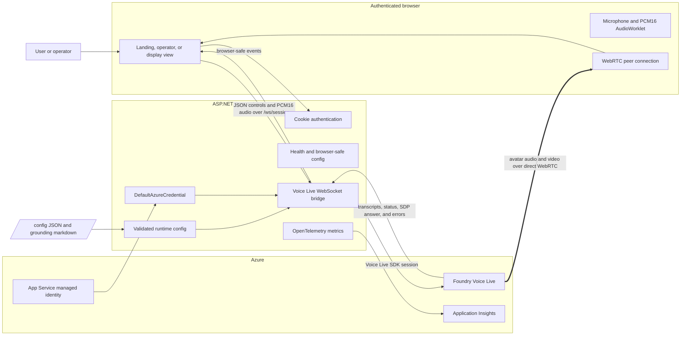
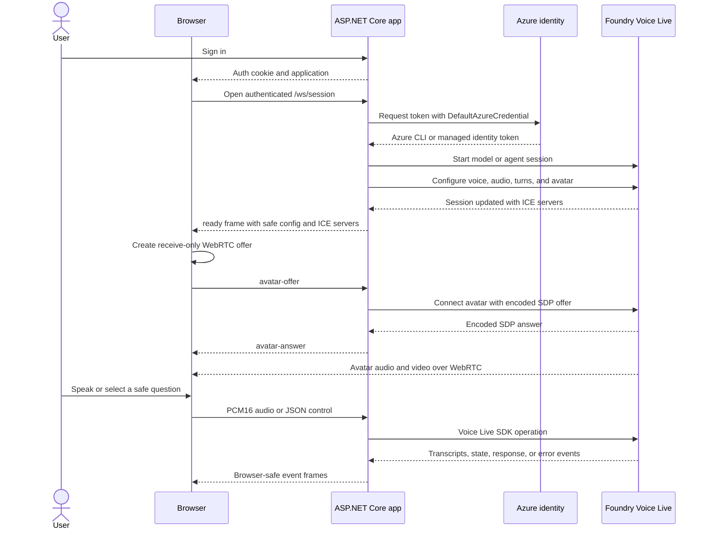

# README Documentation Update Implementation Plan

> **For agentic workers:** REQUIRED SUB-SKILL: Use superpowers:subagent-driven-development (recommended) or superpowers:executing-plans to implement this plan task-by-task. Steps use checkbox (`- [ ]`) syntax for tracking.

**Goal:** Rewrite the repository README with a developer-focused product description, Mermaid visual overview, local-first quickstart, and detailed architecture reference.

**Architecture:** Keep `README.md` as the single developer orientation page while linking to the existing runbook, configuration schema, and rehearsal checklist for exhaustive operational details. Describe the implemented browser, ASP.NET Core, Voice Live, WebRTC, configuration, identity, observability, and Azure deployment boundaries without changing application behavior.

**Tech Stack:** GitHub-flavored Markdown, Mermaid, ASP.NET Core 10, TypeScript, WebSockets, WebRTC, Azure AI Foundry Voice Live, Azure Developer CLI, Bicep

---

## File structure

- Modify: `README.md` — primary product overview, quickstart, architecture, deployment summary, repository map, and reference links.
- Reference only: `web/src/VoiceLive.Web/Program.cs` — HTTP/WebSocket host, authentication, security, health, session gate, identity, and telemetry.
- Reference only: `web/src/VoiceLive.Web/Session/VoiceLiveWebSocketBridge.cs` — browser/service event bridge and failure behavior.
- Reference only: `web/src/VoiceLive.Web/Session/SessionOptionsBuilder.cs` — Voice Live model, agent, audio, turn-taking, and avatar configuration.
- Reference only: `web/frontend/src/main.ts` — WebSocket, WebRTC, microphone, PCM16, and cleanup behavior.
- Reference only: `web/frontend/src/views.ts` — landing, operator, and display views.
- Reference only: `infra/resources.bicep` and `azure.yaml` — Azure resources, identity, app settings, build, and deployment hooks.
- Reference only: `docs/runbook.md`, `docs/config-schema.md`, and `docs/rehearsal-checklist.md` — authoritative linked operational documentation.

### Task 1: Rewrite the developer-facing README

**Files:**
- Modify: `README.md`

- [ ] **Step 1: Capture the current README baseline**

Run:

```bash
git --no-pager diff -- README.md
```

Expected: no diff unless the user has made an unrelated README edit. If a diff exists, preserve it while applying the approved structure.

- [ ] **Step 2: Replace the README with the approved developer-first content**

Use the following complete content:

````markdown
# Foundry Voice Live Avatar

A stage-ready conversational avatar built on Microsoft Foundry Voice Live. The application combines a thin browser client with an ASP.NET Core server so users can speak naturally with a realtime AI avatar while Azure credentials and Voice Live session ownership remain on the server.

The application provides three browser experiences:

- **Landing view** (`/`) — a minimal fullscreen avatar with the active talk control and optional transcript.
- **Operator view** (`/?view=operator`) — avatar, connection diagnostics, transcripts, safe questions, stop/repeat controls, and agent tool activity.
- **Display view** (`/?view=display`) — a passive fullscreen avatar intended for a separate audience-facing display.

It runs in **model mode** by default with `gpt-realtime`. An optional **agent mode** connects to a Voice Live agent hosted in Azure AI Foundry. Reliability features include manual turn gating, reconnect controls, explicit health and session errors, safe questions, and voice-only degradation when avatar rendering capacity is unavailable.

## How it works



The application has two distinct realtime paths:

- **Audio and control plane:** the browser sends JSON controls and 24 kHz mono PCM16 microphone audio to the ASP.NET Core server over `/ws/session`. The server owns the Voice Live SDK session and forwards service events back to the browser.
- **Avatar media plane:** avatar audio and video travel directly from Voice Live to the browser over WebRTC. The server relays the browser SDP offer, the service SDP answer, and ICE metadata, but it does not proxy the media stream.

## Quickstart

### Prerequisites

- [.NET 10 SDK](https://dotnet.microsoft.com/download)
- [Node.js 24](https://nodejs.org/)
- [Azure CLI](https://learn.microsoft.com/cli/azure/install-azure-cli)
- Access to an Azure AI Foundry resource that supports Voice Live and avatar rendering
- `Cognitive Services User` and the applicable Foundry/Azure AI user role on the resource or project

### Run locally

1. Sign in to Azure and select the subscription that contains the Voice Live resource:

   ```bash
   az login
   az account set --subscription <subscription-id>
   ```

2. From the repository root, start the web application:

   ```bash
   dotnet run --project web/src/VoiceLive.Web
   ```

   The MSBuild `BuildFrontend` target installs and builds the TypeScript frontend automatically when needed.

3. Open [http://localhost:5280/](http://localhost:5280/) and sign in with the development credentials:

   ```text
   Username: operator
   Password: rehearsal
   ```

4. Grant microphone access, wait for the avatar connection, then use **Hold to talk**. Open [http://localhost:5280/?view=operator](http://localhost:5280/?view=operator) for detailed session status or [http://localhost:5280/?view=display](http://localhost:5280/?view=display) for the passive display.

Check startup configuration independently with:

```bash
curl -s http://localhost:5280/api/health; echo
```

If session startup reports an Azure credential error, refresh the local credential with `az login` and confirm the signed-in identity has the required resource roles. If avatar capacity is unavailable, the UI reports the avatar error and the voice session continues without video.

## Deploy to Azure

The repository uses Azure Developer CLI and Bicep to provision an Azure AI Foundry account and project, Linux App Service, Application Insights, Log Analytics, managed identity, and RBAC.

```bash
az login && azd auth login
azd env new <name>
azd env set AZURE_LOCATION swedencentral
azd env set AUTH_USERNAME <user>
azd env set AUTH_PASSWORD <password>
azd up
```

`azd up` builds the frontend, provisions the infrastructure, deploys the web app, and configures model mode with `gpt-realtime`. Open the printed App Service URL and sign in with the configured credentials.

To use agent mode, create a Voice Live agent in the Azure AI Foundry portal, set its name and project in `config/agent.json`, run `azd env set VOICELIVE_MODE agent`, and deploy again.

See the [runbook](docs/runbook.md) for region guidance, self-contained deployment fallback, RBAC details, agent setup, and troubleshooting.

## Session startup



## Architecture

### Application host and endpoints

`web/src/VoiceLive.Web/Program.cs` is the composition root for the single ASP.NET Core application. It configures:

- cookie authentication with an eight-hour sliding session;
- login rate limiting by remote IP;
- HSTS and HTTPS redirection outside development;
- CSP and other security response headers;
- WebSocket origin validation, keepalive, and a concurrent-session gate;
- startup config validation and `/api/health`;
- `DefaultAzureCredential`, optionally targeting a configured managed-identity client ID;
- OpenTelemetry metrics with optional Azure Monitor export;
- static hosting for the built frontend.

The public application surface is:

| Endpoint | Authentication | Responsibility |
| --- | --- | --- |
| `GET /login` | Anonymous | Render the operator sign-in form. |
| `POST /login` | Anonymous, rate limited | Validate configured app credentials and issue the auth cookie. |
| `POST /logout` | Anonymous | Clear the auth cookie. |
| `GET /api/health` | Anonymous | Return healthy only when runtime configuration loaded successfully. |
| `GET /api/config` | Required | Return sanitized browser-safe configuration. |
| `WS /ws/session` | Required | Own and bridge one server-side Voice Live session. |

Unauthenticated HTML requests redirect to `/login`; unauthenticated `/api/*` and `/ws/*` requests return 401.

### Configuration and session options

Runtime configuration comes from application settings plus JSON and grounding markdown under `/config`:

```text
config/
├── agent.json
├── avatar.json
├── session.json
├── turntaking.json
└── grounding/
```

The server validates configuration during startup and retains either the parsed configuration or a validation error. The browser never receives the Azure credential or the complete server configuration.

`SessionOptionsBuilder` translates the validated configuration into Voice Live SDK options:

- **Model mode:** sets the realtime model and grounding instructions from application configuration.
- **Agent mode:** lets the configured Foundry agent own its model, instructions, and hosted tools.
- **Audio:** uses PCM16 input/output at 24 kHz, with configured noise reduction, echo cancellation, and transcription where the active turn mode supports them.
- **Turn taking:** maps gated/manual, open-mic, or hybrid settings to Voice Live turn detection.
- **Avatar:** configures character, optional style, resolution, bitrate, codec, and optional HTTPS background.

See the [config schema](docs/config-schema.md) for every field and validation rule.

### Server-side Voice Live bridge

Each authenticated browser WebSocket creates one `VoiceLiveWebSocketBridge` and one Voice Live session. The bridge runs two pumps until either side closes:

1. **Browser to Voice Live**
   - Binary frames contain microphone PCM16 audio.
   - `avatar-offer` starts avatar WebRTC negotiation.
   - `start-turn` and `end-turn` manage gated audio turns.
   - `barge-in` cancels the active response.
   - `say` sends a safe question or operator prompt.
   - `ping` receives a `pong` response.

2. **Voice Live to browser**
   - `ready` carries the active mode, safe questions, avatar identity, and ICE servers.
   - transcript frames stream user and agent text.
   - speech and avatar frames update UI state.
   - `avatar-answer` carries the decoded SDP answer.
   - tool frames expose agent function and MCP activity when the service emits it.
   - `response-done`, `avatar-error`, and `error` describe completion and failures.

The bridge caps inbound messages at 1 MiB, serializes outgoing WebSocket writes, records active-session/error/duration metrics, sanitizes unexpected exceptions, and disposes the Voice Live session when either pump ends.

### Browser client and views

The browser application uses a thin TypeScript client plus a runtime audio worklet:

- `views.ts` renders the landing, operator, or display DOM.
- `main.ts` opens `/ws/session`, handles server events, negotiates WebRTC, captures microphone audio, and cleans up browser resources.
- `web/src/VoiceLive.Web/wwwroot/pcm-worklet.js` converts browser audio samples to signed PCM16 and resamples from the actual audio-context rate when necessary.

For avatar negotiation, the browser creates a receive-only `RTCPeerConnection` with audio and video transceivers. It sends the gathered SDP offer through the server and applies the returned SDP answer. Incoming media tracks are attached directly to the page's `<video>` element.

Interactive views request a mono microphone stream and route it through an `AudioWorklet`. In gated mode, audio is sent only while the talk control is held; open-mic and hybrid modes stream continuously until muted. The client also handles transcripts, tool notifications, non-fatal avatar failures, fatal errors, reconnect controls, and teardown of media tracks, audio nodes, `AudioContext`, WebRTC, timers, and WebSocket state.

### Authentication and trust boundaries

The application uses two separate identities:

- **Operator to application:** ASP.NET Core cookie authentication using `Auth:Username` and `Auth:Password`.
- **Application to Azure:** `DefaultAzureCredential`, which uses Azure CLI credentials locally and the App Service system-assigned managed identity after deployment.

The browser never receives an Azure access token. In Azure, Bicep assigns the App Service identity the required Cognitive Services and Foundry project roles.

### Observability and failure behavior

The app exposes configuration health through `/api/health` and records OpenTelemetry metrics for active Voice Live sessions, session duration, and service errors. When `APPLICATIONINSIGHTS_CONNECTION_STRING` is present, telemetry is exported through Azure Monitor.

Failures remain explicit:

- invalid startup configuration returns unhealthy status and prevents session creation;
- login attempts are rate limited;
- disallowed WebSocket origins, session-capacity exhaustion, and oversized messages are rejected;
- fatal Voice Live errors produce an `error` frame and close the browser session;
- avatar rendering capacity or quota errors produce an `avatar-error` frame, close only the avatar peer connection, and keep voice available;
- browser media, WebRTC, or socket failures show a reconnect action.

Each browser tab currently owns an independent Voice Live session. The operator and display views do not share one conversation. Hosted agent tools can also execute entirely in the service without a discrete client-visible tool event.

### Azure deployment architecture

`azd up` uses `azure.yaml` and the Bicep modules under `/infra` to create:

- an Azure AI Foundry account and project with local authentication disabled;
- a Linux B1 App Service plan;
- an App Service with system-assigned managed identity, WebSockets, always-on, TLS 1.2 minimum, and `/api/health` as its health check;
- Log Analytics and workspace-based Application Insights;
- Cognitive Services and Foundry project RBAC assignments for the App Service identity.

The `azure.yaml` prebuild hook runs `npm ci && npm run build` in `web/frontend`. The post-provision hook detects existing Voice Live agents and prints the opt-in agent-mode steps; it does not create or modify an agent.

## Repository layout

```text
.
├── config/                 Runtime Voice Live, avatar, agent, and turn-taking configuration
├── docs/                   Runbook, configuration reference, rehearsal checklist, specs, and plans
├── infra/                  Azure App Service, Foundry, telemetry, and RBAC Bicep
├── scripts/                Post-provision agent discovery helpers
├── web/
│   ├── frontend/           TypeScript browser client and Playwright tests
│   ├── src/VoiceLive.Web/  ASP.NET Core application
│   └── tests/              Backend tests
├── azure.yaml              Azure Developer CLI service and hooks
└── README.md               Developer orientation and architecture
```

## Reference documentation

- [Runbook](docs/runbook.md) — deployment, RBAC, operation, failure handling, and troubleshooting.
- [Configuration schema](docs/config-schema.md) — complete config fields and validation rules.
- [Rehearsal checklist](docs/rehearsal-checklist.md) — event preparation and fallback checks.
- [Current project specification](docs/initial-spec.md) — product context and design history.
- [Web application notes](web/README.md) — endpoint and browser-verification details.
````

- [ ] **Step 3: Inspect the README diff for accidental loss or duplication**

Run:

```bash
git --no-pager diff -- README.md
```

Expected: one intentional README rewrite containing the product description, two Mermaid diagrams, local quickstart, concise Azure deployment, detailed architecture, repository layout, and reference links. No application source or configuration files change.

### Task 2: Validate documentation accuracy and rendering inputs

**Files:**
- Validate: `README.md`

- [ ] **Step 1: Check Markdown whitespace and patch validity**

Run:

```bash
git --no-pager diff --check -- README.md
```

Expected: exit code 0 with no output.

- [ ] **Step 2: Verify every repository-relative README link resolves**

Run:

```bash
python - <<'PY'
from pathlib import Path
import re

readme = Path("README.md")
text = readme.read_text()
missing = []
for target in re.findall(r"\[[^\]]+\]\(([^)]+)\)", text):
    if "://" in target or target.startswith("#"):
        continue
    path = (readme.parent / target.split("#", 1)[0]).resolve()
    if not path.exists():
        missing.append(target)
if missing:
    raise SystemExit("Missing README links: " + ", ".join(missing))
print("All repository-relative README links resolve.")
PY
```

Expected:

```text
All repository-relative README links resolve.
```

- [ ] **Step 3: Verify Mermaid blocks are balanced and use supported diagram types**

Run:

```bash
python - <<'PY'
from pathlib import Path
import re

text = Path("README.md").read_text()
blocks = re.findall(r"```mermaid\n(.*?)\n```", text, flags=re.S)
assert len(blocks) == 2, f"expected 2 Mermaid blocks, found {len(blocks)}"
assert blocks[0].lstrip().startswith("flowchart "), "first diagram must be a flowchart"
assert blocks[1].lstrip().startswith("sequenceDiagram"), "second diagram must be a sequence diagram"
print("README contains the expected Mermaid overview and sequence diagrams.")
PY
```

Expected:

```text
README contains the expected Mermaid overview and sequence diagrams.
```

- [ ] **Step 4: Cross-check documented implementation facts**

Run:

```bash
rg -n \
  "MapHealthChecks|MapGet\\(\"/api/config\"|Map\\(\"/ws/session\"|DefaultAzureCredential|MaxMessageBytes|BrowserPcmSamplingRate|new AudioContext|RTCPeerConnection|system-assigned|webSocketsEnabled|healthCheckPath" \
  web/src/VoiceLive.Web web/frontend/src infra/resources.bicep README.md
```

Expected: matches show that the README's health, config, WebSocket, credential, 1 MiB message limit, 24 kHz audio, WebRTC, managed identity, WebSocket enablement, and health-check claims correspond to the current implementation.

- [ ] **Step 5: Review the final change set**

Run:

```bash
git --no-pager status --short
git --no-pager diff --stat
```

Expected: `README.md` is the only implementation file modified by this plan. The pre-existing untracked `licence.md` remains untouched.

- [ ] **Step 6: Commit the README update**

Run:

```bash
git add README.md
git commit -m "docs: expand README overview and architecture" \
  -m "Co-authored-by: Copilot <223556219+Copilot@users.noreply.github.com>" \
  -m "Copilot-Session: a90901eb-f99d-4823-92f4-11981e144a7a"
```

Expected: a new commit containing only the README rewrite.
