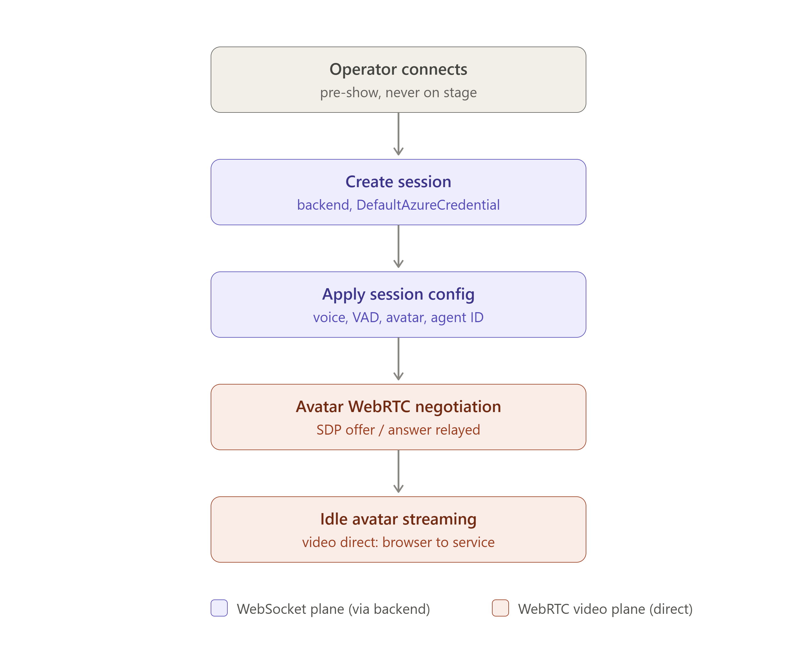
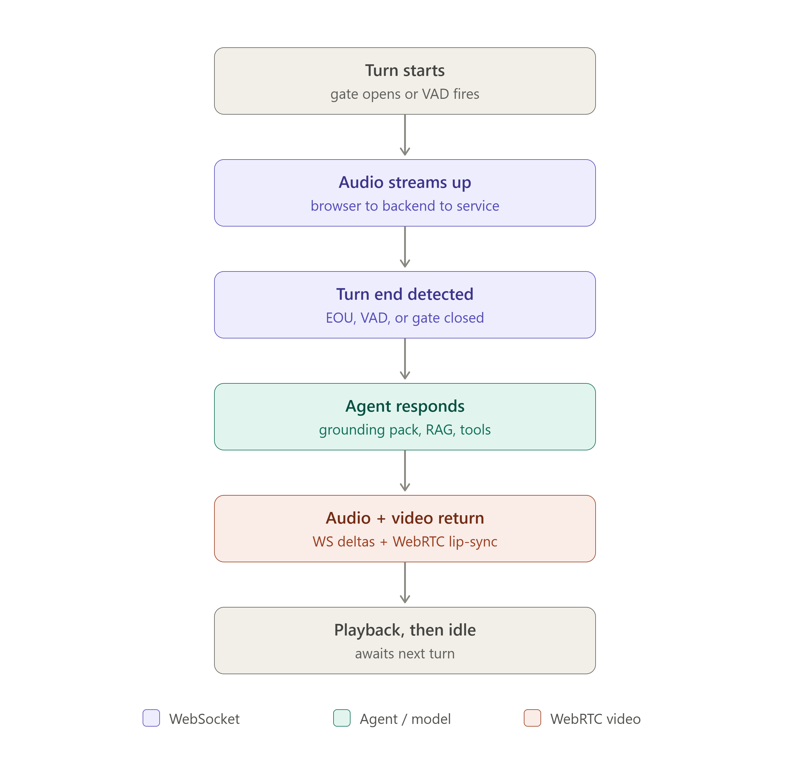
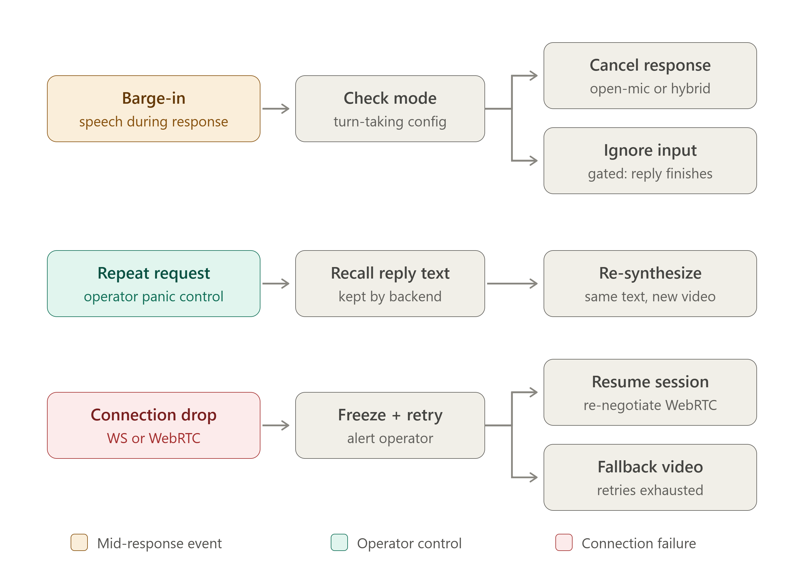

# Session flow and state

How a session starts, how a turn runs, what the status indicators mean, and what each view can do. For frame payloads see [`wire-protocol.md`](wire-protocol.md).

## Connection flow

The browser holds no Azure credential at any point. The server acquires the token, opens the upstream session, and only then tells the browser it is `ready`. Avatar media is negotiated afterwards and flows directly browser↔Azure over WebRTC.

## A single turn

In **gated** mode a turn is explicitly bracketed by the operator:

1. Operator presses **Hold to talk** → client sends `start-turn` and begins streaming microphone audio.
2. Binary PCM16 frames flow while the button is held. Server-side VAD emits `speech-started` / `speech-stopped`.
3. Interim `user-transcript` frames arrive with `final: false`; each interim chunk **appends** to the accumulating live text. When recognition is complete, one final frame arrives with `final: true` and **replaces** the accumulated text.
4. Operator releases → client sends `end-turn` and stops streaming audio.
5. The model responds: `agent-transcript` frames stream in, `avatar-speaking` fires when audio playback begins, avatar video and audio arrive over the WebRTC media plane.
6. `avatar-idle` then `response-done` close the turn.

**Safe questions** (operator view only) skip steps 1–4: clicking one sends a single `say` frame and the flow resumes at step 5.

**Barge-in** (operator view only) sends `barge-in` during step 5 to interrupt the avatar.

### Turn-taking modes

| Mode | How turns start | `start-turn` / `end-turn` sent? | VAD segments turns? |
|---|---|---|---|
| `gated` | Hold to talk (default) | Yes, by the operator | No |
| `open-mic` | Automatically on `ready` | No | Yes — Azure semantic VAD |
| `hybrid` | Automatically on `ready` | No | Yes — Azure semantic VAD |

The active mode is reported in the `ready` frame as `activeMode`. `wireInteractiveControls` in `main.ts` binds the pointer handlers for Hold to talk only when `activeMode === "gated"`; in `open-mic` and `hybrid` the microphone streams continuously from the moment it is ready.

### Rules and edge cases

- **Wait for `ready`.** Frames sent before it are not honoured.
- **Mute** toggles microphone streaming (`streamingMic`) independently of the turn state. Muting mid-turn stops the audio byte stream without sending `end-turn`, so the model receives a truncated utterance.
- **Barge-in outside avatar speech** is harmless but pointless — there is nothing to interrupt.
- **`barge-in` and `say` are operator-view only.** The landing view wires neither; it has no `stopButton`, `repeatButton`, or `safeQuestionButtons`. See the per-view table in [`wire-protocol.md`](wire-protocol.md).

## Decision points

The branch points that determine what an operator sees: model mode vs. agent mode, avatar capacity availability, and connection outcomes.

## Status channels

The operator view exposes six independent status channels. The landing view surfaces only `connection` and `webrtc` in a transient pill. The display view collapses all three of `connection`, `webrtc`, and `avatar` into a single status string.

| Channel | Representative values | Meaning when unhealthy |
|---|---|---|
| `connection` | `ready` (healthy); `connecting`; `connected; waiting for ready`; `disconnected` | WebSocket to the app is down. The **Reconnect** button appears; nothing else works until reconnected. |
| `webrtc` | `connected` (healthy); `creating peer connection`; `offer sent; waiting for answer`; `failed`; `avatar disabled (capacity)` | Media-plane failure. Both avatar audio and video are lost because both transceivers ride the same peer connection — closing it ends all inbound media. **There is no voice-only fallback.** The WebSocket, microphone, and transcripts all survive; the room loses all audible output. See [runbook.md](runbook.md) §9. |
| `microphone` | `ready` / `live` (healthy); `requesting permission`; `muted` | No audio input reaches the model. Safe questions still work in operator view. |
| `turn` | `gated: hold to talk` / `open-mic: streaming continuously` (idle); `recording gated turn` (active) | Stuck on `recording gated turn` → a `start-turn` was never closed; release and re-press Hold to talk. |
| `speech` | `started` / `stopped` | Server-side VAD. Never showing `started` while speaking → the microphone is muted or capturing silence. |
| `avatar` | `speaking` / `idle` (healthy); `unavailable` | `unavailable` means an `avatar-error` frame was received. Check the `webrtc` channel for details. |

## The three views

All three are the same app shell, selected by query string, and **each open tab is its own session consuming one concurrency slot**. `SessionGate` is a singleton `SemaphoreSlim` backed by `VoiceLiveOptions.MaxConcurrentSessions` (default `2`, configured in `appsettings.json`). One WebSocket upgrade = one slot acquired; closing the WebSocket releases it.

| View | URL | Microphone | Controls | Intended screen |
|---|---|---|---|---|
| Landing | `/` | Yes | Hold to talk (gated mode only); the ⚙ gear is the only route to the operator view | Setup and testing |
| Operator | `/?view=operator` | Yes | Hold to talk, mute, safe questions, barge-in, all six status channels, Reconnect | The operator's laptop, never visible to the audience |
| Display | `/?view=display` | **No** | Avatar video only; Reconnect appears on disconnect | The stage screen |

**Two consequences worth planning for:**

- The display view has no microphone and no interaction affordance, yet a browser will still block autoplay until the page receives a user gesture. The app calls `play()` on an unmuted element; a `NotAllowedError` from the browser tears down the whole Voice Live session (not just the video) and shows a fatal error banner. **Always click into the display screen once before the audience arrives.** Recovery: click **Reconnect** (the click satisfies the gesture requirement and restarts the session); reload only if Reconnect still fails. See [runbook.md](runbook.md) §7.
- Reconnection is operator-initiated; there is no automatic reconnect. An unattended display screen that disconnects stays disconnected until someone clicks Reconnect.
